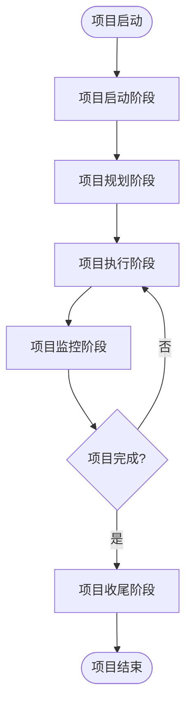

# 📊 项目管理标准实施流程

## 主流程图

---

## 一、🚀 项目启动阶段

**目标**: 明确项目目标、获得授权、组建团队

### 主要任务

| 序号 | 任务 | 说明 |
|------|------|------|
| 1 | 项目立项 | 可行性研究、商业论证、项目建议书 |
| 2 | 组建项目团队 | 任命项目经理、确定核心成员、明确角色职责 |
| 3 | 召开启动会 | 介绍项目背景、目标和计划、团队认识 |
| 4 | 制定项目章程 | 正式授权项目、明确项目经理权限 |

### 📄 阶段交付物
- 项目章程
- 项目建议书
- 可行性研究报告
- 项目启动会议纪要

---

## 二、📋 项目规划阶段

**目标**: 制定详细的项目管理计划

### 主要任务

| 序号 | 任务 | 说明 |
|------|------|------|
| 1 | 需求分析 | 收集需求、需求评审、需求确认 |
| 2 | 范围定义 | 确定项目边界、制定范围说明书 |
| 3 | WBS分解 | 创建工作分解结构、定义工作包 |
| 4 | 进度计划 | 定义活动、排序、估算工期、制定进度 |
| 5 | 资源计划 | 识别资源需求、制定资源日历 |
| 6 | 成本计划 | 成本估算、制定预算、成本控制基线 |
| 7 | 质量计划 | 质量标准、质量保证措施、验收标准 |
| 8 | 风险计划 | 识别风险、评估风险、制定应对策略 |
| 9 | 沟通计划 | 确定干系人、沟通方式、报告机制 |

### 📄 阶段交付物
- 项目管理计划
- WBS（工作分解结构）
- 进度计划
- 成本预算
- 风险登记册
- 沟通计划
- 质量管理计划

---

## 三、⚙️ 项目执行阶段

**目标**: 按计划完成项目工作

### 主要任务

| 序号 | 任务 | 说明 |
|------|------|------|
| 1 | 项目执行 | 按计划开展工作、产出可交付成果 |
| 2 | 团队建设 | 培训、激励、绩效考核、冲突解决 |
| 3 | 质量保证 | 质量审计、过程改进、标准执行 |
| 4 | 采购管理 | 供应商选择、合同签订、采购执行 |

### 📄 阶段交付物
- 可交付成果
- 工作绩效数据
- 变更请求
- 问题日志
- 团队绩效评估

---

## 四、📈 项目监控阶段

**目标**: 跟踪、审查和调整项目进展与绩效

### 主要任务

| 序号 | 任务 | 说明 |
|------|------|------|
| 1 | 进度监控 | 跟踪进度、分析偏差、调整计划 |
| 2 | 成本控制 | 监控支出、分析成本偏差、控制预算 |
| 3 | 质量控制 | 检查、测试、验收、缺陷修复 |
| 4 | 变更管理 | 变更申请、影响分析、审批、实施 |
| 5 | 风险监控 | 跟踪风险、识别新风险、应对措施 |

### 📄 阶段交付物
- 工作绩效报告
- 变更日志
- 更新的项目管理计划
- 风险登记册更新

---

## 五、✅ 项目收尾阶段

**目标**: 正式结束项目或阶段

### 主要任务

| 序号 | 任务 | 说明 |
|------|------|------|
| 1 | 项目验收 | 最终产品验收、客户确认、签署验收单 |
| 2 | 项目总结 | 经验教训总结、项目绩效评估、表彰 |
| 3 | 项目归档 | 文档整理、知识沉淀、档案移交 |
| 4 | 资源释放 | 团队解散、设备归还、合同关闭 |

### 📄 阶段交付物
- 验收报告
- 项目总结报告
- 经验教训登记册
- 归档文件
- 释放的资源

---

## 🔑 关键成功因素

| 序号 | 因素 | 说明 |
|------|------|------|
| 1 | 明确的目标 | 项目目标清晰、可衡量、可实现 |
| 2 | 有效的沟通 | 保持信息透明、及时反馈问题 |
| 3 | 风险管理 | 提前识别风险、制定应对措施 |
| 4 | 变更控制 | 严格变更流程、控制范围蔓延 |
| 5 | 干系人管理 | 识别干系人、管理期望 |
| 6 | 质量管理 | 全过程质量控制、持续改进 |

---

## 🔄 流程特点

1. **迭代性**: 监控阶段可能多次返回到执行阶段
2. **灵活性**: 根据实际情况调整计划
3. **全面性**: 覆盖项目全生命周期
4. **可控性**: 通过监控确保项目目标达成

---

*基于PMBOK方法论*

*生成时间: 2026-02-13*
